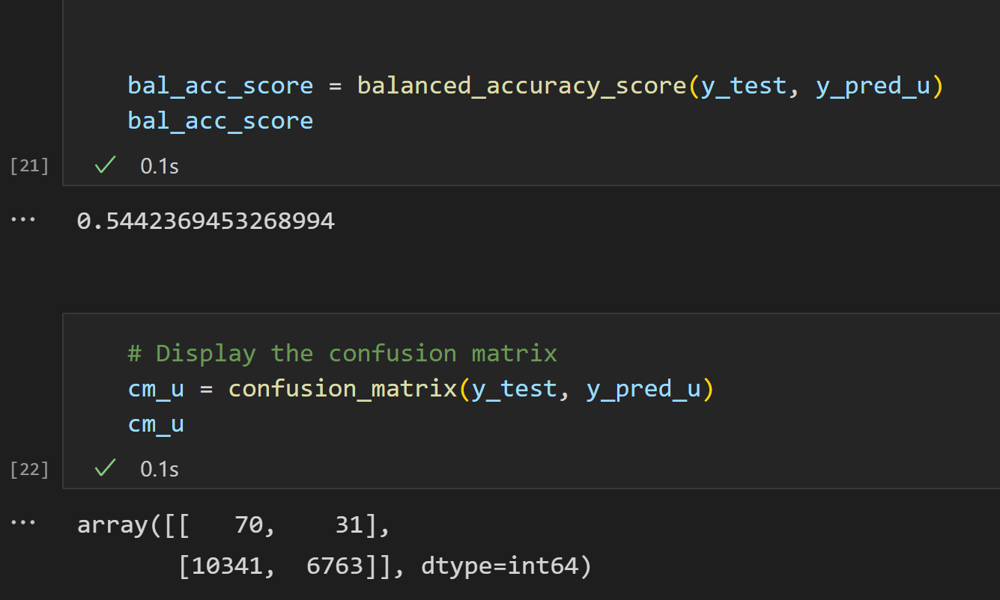

# Credit_Risk_Analysis

## Overview

The purpose of this project is to compare the accuracy of different machine learning models in predicting whether a credit card loan has a high risk of going into default.

## Results

### Naive Oversampling

### SMOTE Oversampling

### ClusterCentroids Undersampling

### Combination Sampling

### Balanced Random Forest

### EasyEnsemble AdaBoost

### Discussion

- The more oversampling, undersampling, and combination sampling methods perform the worst balanced accuracy scores, at around 50% to 65%.
- The balanced random forest does significantly better, at around 79%.
- The AdaBoost classifier performs the best, at around 93% accuracy.

## Summary

Most classifiers performed fairly well, with lower balanced accuracy scores at above 50% or 60%. I recommend the AdaBoost classifier because it has the highest balanced accuracy score at around 93% and has high sensitivity. High sensitivity is important for identifying potential bad loans for investigation.
